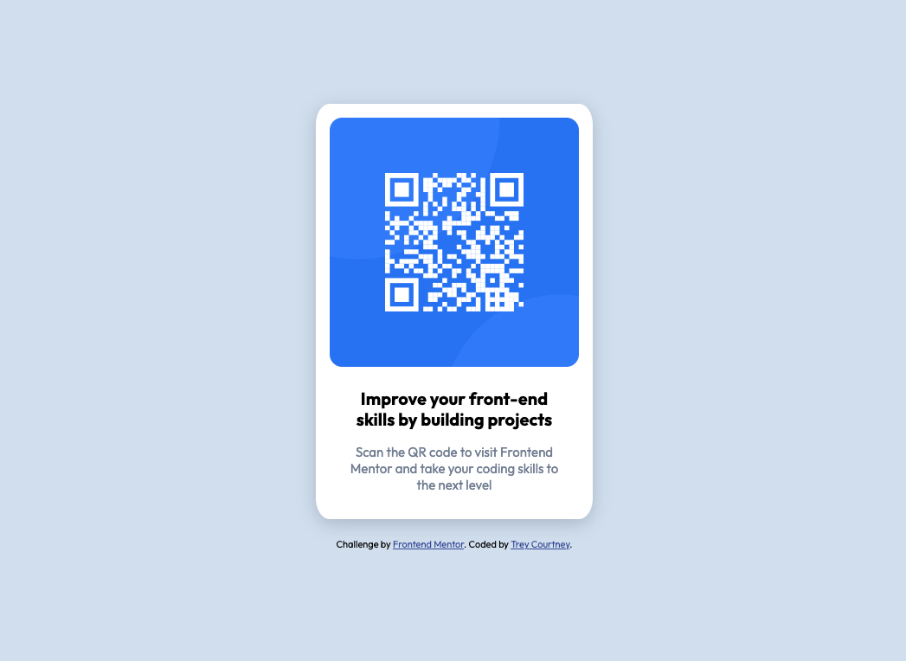

# Frontend Mentor - QR code component solution

This is a solution to the [QR code component challenge on Frontend Mentor](https://www.frontendmentor.io/challenges/qr-code-component-iux_sIO_H). Frontend Mentor challenges help you improve your coding skills by building realistic projects. 

## Table of contents

- [Overview](#overview)
  - [Screenshot](#screenshot)
  - [Links](#links)
- [My process](#my-process)
  - [Built with](#built-with)
- [Author](#author)
- [Acknowledgments](#acknowledgments)

## Overview
This is my first project for Front End Mentor. It's a simple QR Code component.

### Screenshot

### Links

- Solution URL: [Solution URL](https://your-solution-url.com)
- Live Site URL: [Live site URL](https://tecour.github.io/QR-Code-Component---Front-End-Mentor/)

## My process
I approached the HTML first and then started working on the CSS styling. I tried to the HTML and CSS as simple as possible according to my knowledge of HTML and CSS. 

### Built with

- HTML5 markup
- CSS 
- Flexbox

## Author

- Website - [Trey Courtney](https://tecour.github.io/QR-Code-Component---Front-End-Mentor/)
- Frontend Mentor - [@tecour](https://www.frontendmentor.io/profile/tecour)
- Twitter - [@treycomusic](https://www.twitter.com/treycomusic)

